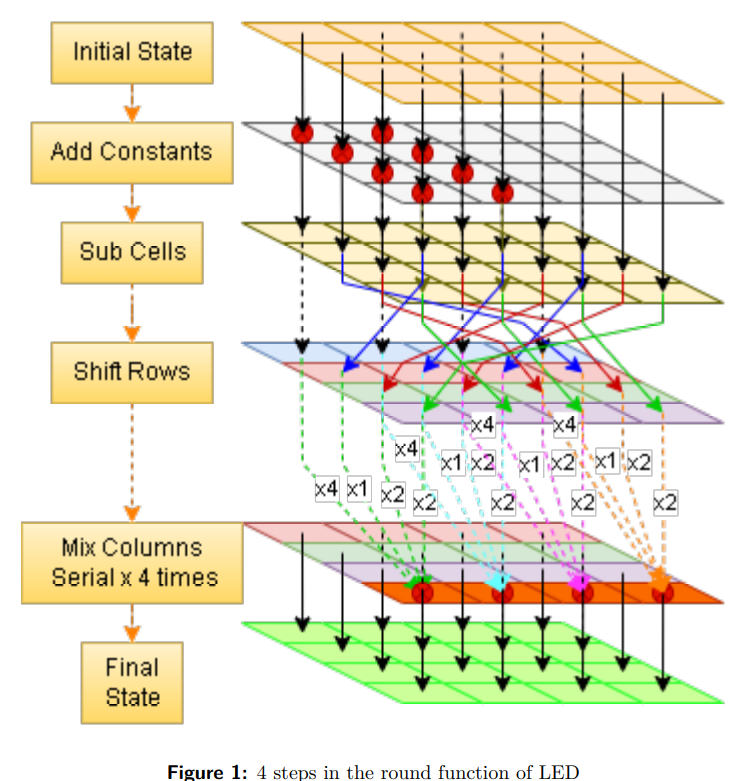

Understood the design of the LED cipher and created illustrations and diagram to show its working. Analyzed the sbox properties of LED cipher and performed preliminary integral and differential cryptanalysis of the cipher. Developed a small application using the cipher. 

[code](https://github.com/CrYpTo-DuCkS/LED_Cipher_Term_paper)