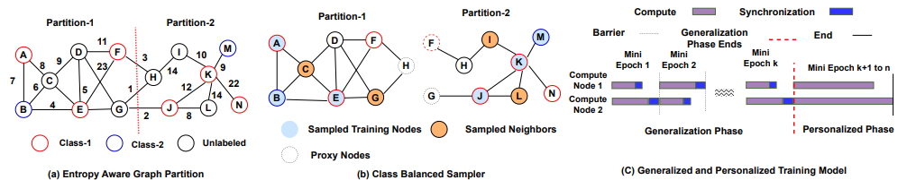

Several distributed frameworks have been developed to scale Graph Neural Networks (GNNs) on billion-size graphs. On several benchmarks, we observe that the graph partitions generated by these frameworks have heterogeneous data distributions and class imbalance, affecting convergence, and resulting in lower performance than centralized implementations. We holistically address these challenges and develop techniques that reduce training time and improve accuracy. We develop an Edge-Weighted partitioning technique to improve the micro average F1 score (accuracy) by minimizing the total entropy. Furthermore, we add an asynchronous personalization phase that adapts each compute-host's model to its local data distribution. We design a class-balanced sampler that considerably speeds up convergence. We implemented our algorithms on the DistDGL framework and observed that our training techniques scale much better than the existing training approach. We achieved a (2-3x) speedup in training time and 4\% improvement on average in micro-F1 scores on 5 large graph benchmarks compared to the standard baselines.

[Code](https://github.com/Anirban600/EAT-DistGNN)
